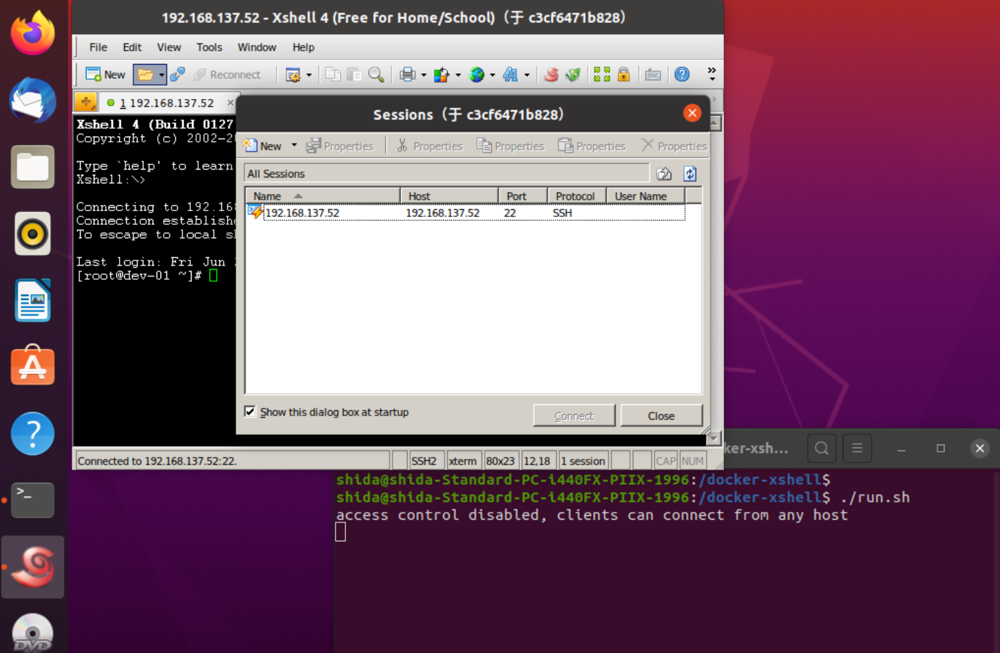

# docker-xshell

Run XShell in Docker container

##  Prepare

For Ubuntu, please ensure that x11-server has been installed:

```sh
# apt-get install x11-xserver-utils
# xhost +
```

For MacOS, TBD...

## Build

```sh
$ bash build.sh
```

## Run

```sh
$ bash run.sh
```

